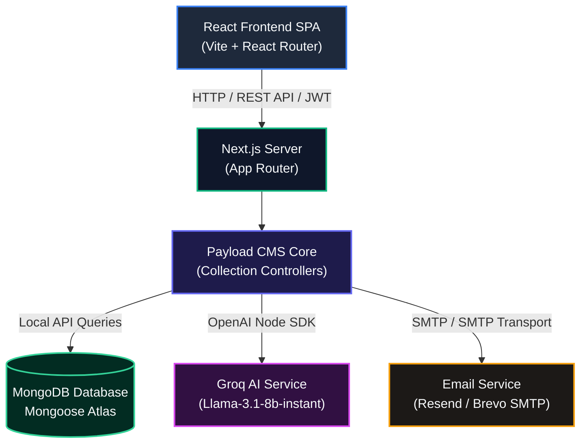
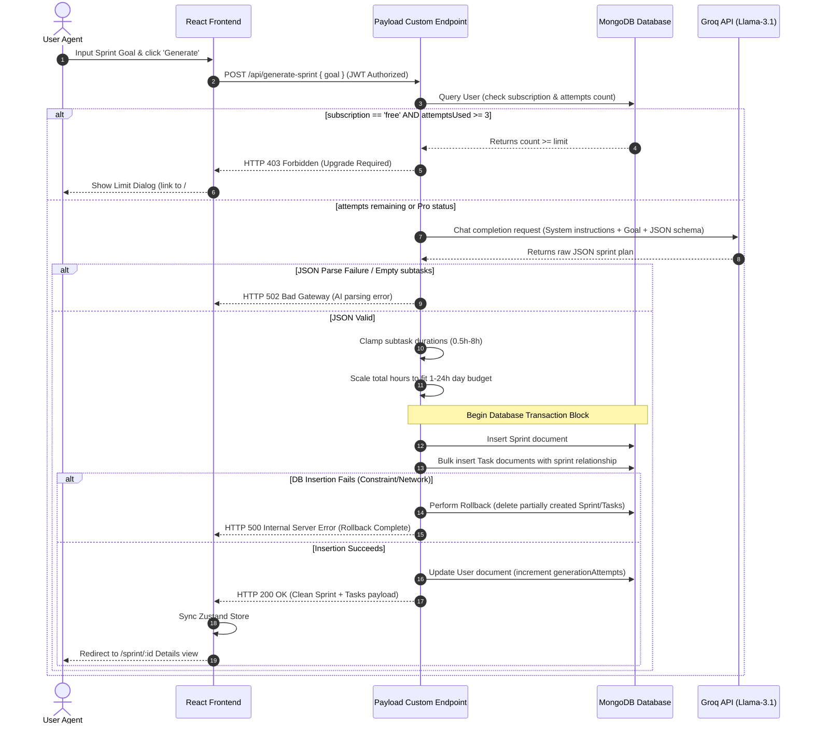
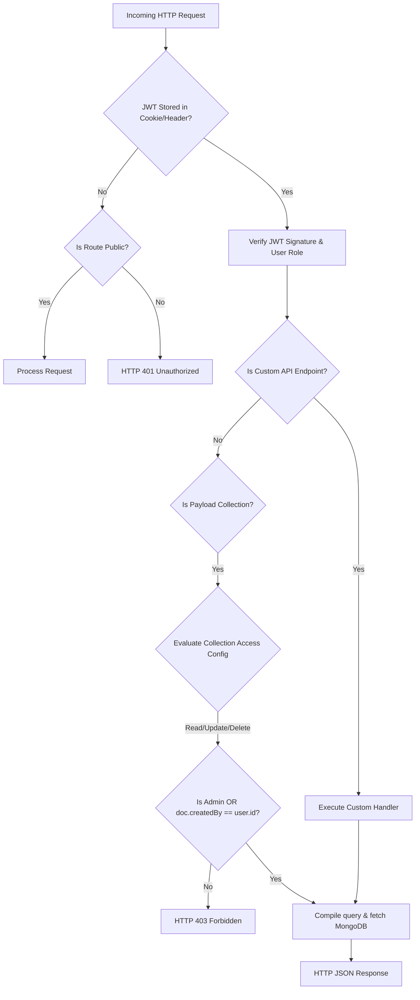

# SprintMaster AI

<div align="center">


[](https://groq.com)
[](https://payloadcms.com)
[](https://www.mongodb.com)


<p align="center">
  <strong>Empower teams and individuals to translate ambitious multi-domain goals into strictly executable one-day sprints with optimized, AI-generated subtasks.</strong>
</p>

[Explore Docs](#api-documentation) · [Report Bug](https://github.com/HusseinIslamEagle/SprintMasterAi/issues) · [Request Feature](https://github.com/HusseinIslamEagle/SprintMasterAi/issues)

</div>

---

## 📋 Table of Contents

- [Executive Summary](#-executive-summary)
- [Key Features](#-key-features)
- [Tech Stack](#-tech-stack)
- [System Architecture](#-system-architecture)
- [Folder Structure](#-folder-structure)
- [Database Design](#-database-design)
- [Authentication & Security](#-authentication--security)
- [API Documentation](#-api-documentation)
- [User Journey](#-user-journey)
- [AI Architecture & Normalization](#-ai-architecture--normalization)
- [Technical Challenges & Solutions](#-technical-challenges--solutions)
- [Performance Optimizations](#-performance-optimizations)
- [Scalability Design](#-scalability-design)
- [Installation & Setup](#-installation--setup)
- [Environment Variables](#-environment-variables)
- [Screenshots & Mockups](#-screenshots--mockups)
- [Deployment Strategy](#-deployment-strategy)
- [Testing Suite](#-testing-suite)
- [Future Roadmap](#-future-roadmap)
- [Engineering Retrospective](#-engineering-retrospective)
- [Developer Notes & Tradeoffs](#-developer-notes--tradeoffs)
- [Contributing](#-contributing)
- [License](#-license)

---

## 🎯 Executive Summary

### The Problem
Ambitious goals across business, operations, academics, and software development often suffer from **scope creep**, **decision paralysis**, and **poor decomposition**. Teams struggle to estimate task sizes accurately, resulting in half-finished backlogs and lost momentum.

### The Solution
**SprintMaster AI** introduces a strict **one-day sprint cycle** (1 to 24 hours). By forcing work to fit a single day, it eliminates multi-day overhead and forces maximum focus. Users submit a high-level goal, and our custom AI engine decomposes it into a prioritized, chronologically sound subtask list with mathematically normalized durations.

### Target Audience & Business Value
* **Entrepreneurs & Product Managers**: Ship features and test market hypotheses rapidly.
* **Students & Researchers**: Divide intensive exam preparation or paper writing into actionable hours.
* **Operations & Sales Teams**: Plan operational onboarding, sales campaigns, or process reviews without administrative friction.
* **Enterprise Decision Makers**: Achieve a **90% reduction in planning cognitive overhead**, ensuring engineers and execution staff spend time shipping, not estimating.

### Key Differentiators
1. **Domain Agnosticism**: Handles technical (software development) and non-technical (marketing, study, operations) goals with contextual accuracy.
2. **Mathematical Normalization**: Dynamically scales subtask durations to fit precisely inside a single-day workspace (1-24h).
3. **Atomic Rollback Architecture**: Prevents database state drift by automatically removing partially created tasks and sprints during batch generation failures.

---

## ✨ Key Features

| Feature | What It Does | Why It Exists | User Benefit | Technical Implementation |
| :--- | :--- | :--- | :--- | :--- |
| **AI Sprint Generator** | Decomposes a raw goal into a structured sprint plan with subtasks. | Translating complex tasks into milestones is manually tedious. | Get a logical daily execution blueprint in under 3 seconds. | Calls **Groq Llama-3.1** via OpenAI SDK; returns strict structured JSON. |
| **Duration Normalizer** | Mathematically scales and rounds subtask durations to total 1-24 hours. | AI-generated estimates often overshoot or undershoot a single day. | Guarantees the sprint is executable within a single day. | Clamps task estimates (0.5h-8h), scales by total ratio, and rounds to the nearest 0.5h. |
| **Pro Sprint Regeneration** | Generates alternative daily execution plans based on historical context. | Users often want alternative approaches or execution styles. | Explore different execution paths without starting from scratch. | Fetches previous task logs and injects them as alternative-path context to Groq. |
| **Bento Kanban Board** | Organizes sprints across Draft, Generated, In Progress, and Done lanes. | Sprints require simple, visual progression tracking. | At-a-glance view of daily workloads and overall velocity. | Built using CSS Grid, **Framer Motion** layout transitions, and Zustand state. |
| **Secure RBAC Data Isolation** | Segregates data based on user roles and document ownership. | Multi-tenant environments require strict privacy guarantees. | Private dashboards; users only access and modify their own sprints. | **Payload CMS Access Control** hooks enforcing ownership queries at DB layer. |
| **Dual-Mode Activation** | Verifies emails via live Resend/SMTP or fallback terminal logging. | Allows seamless local developer testing without requiring email APIs. | Hassle-free local developer signups; secure email validation in production. | Checks for env keys; uses **Resend Adapter** or defaults to standard local dev logging. |

---

## 🛠️ Tech Stack

### Frontend
| Technology | Category | Purpose |
| :--- | :--- | :--- |
| **React 18** | Core UI | component-driven rendering hierarchy |
| **Vite 5** | Build Tooling | Lightning-fast Hot Module Replacement (HMR) and bundling |
| **TypeScript** | Language | Compile-time type safety across API clients and components |
| **TailwindCSS** | Styling | Rapid utility-first styling with responsive, modern spacing |
| **Framer Motion** | Animation | Smooth, hardware-accelerated page and list-item transitions |
| **TanStack Query v5** | Server State | Declarative cache management, pagination, and data refetching |
| **Zustand** | Client State | Lightweight state store coordinating sprints and UI preferences |
| **Shadcn UI & Radix** | UI Components | Accessible, premium unstyled primitives (Accordion, Dialog, Drawer) |

### Backend & Database
| Technology | Category | Purpose |
| :--- | :--- | :--- |
| **Next.js 15 (App Router)** | Framework | Serves backend API routes and custom Payload endpoints |
| **Payload CMS 3.0** | Headless Engine | Structured schema configuration, automated admin panel, and local API |
| **MongoDB Atlas** | Database | Scalable Document store saving users, sprints, tasks, and media |
| **Mongoose Adapter** | ORM / DB Layer | Official Payload database connector mapping JS objects to MongoDB |

### Services & Security
| Technology | Category | Purpose |
| :--- | :--- | :--- |
| **Groq AI (Llama-3.1-8b)** | AI Inference | Context-aware sprint plan decomposition and JSON generation |
| **Resend / Nodemailer** | Email | Delivers verification links to activate registered users |
| **JWT (JSON Web Tokens)** | Auth | Secure, stateless authentication via HTTP-only cookies and headers |
| **Bcrypt / Argon2** | Encryption | Auto-hashes user passwords inside the database |

---

## 📐 System Architecture

### High-Level Architecture Diagram
SprintMaster AI utilizes a decoupled Monorepo architecture. The Single Page Application (SPA) frontend communicates with the unified Next.js/Payload CMS backend via REST API routes using JSON Web Tokens.



### System Flow Diagram (Sprint Generation)
This diagram illustrates the process of generating a sprint, including safety checks, rate limiting, Groq API call, duration normalization, and transaction rollbacks.



### Request Lifecycle Diagram
How authorization, authentication, custom routes, and collection-level Row Level Security (RLS) guard resources.



---

## 📁 Folder Structure

```text
SprintMasterAi/
├── FE-sprint-master-ai/       # Frontend Application (React + Vite)
│   ├── public/                 # Static assets (Favicons, Logo, SVGs)
│   ├── src/                    # Source files
│   │   ├── auth/               # AuthContext, ProtectedRoute wrapper
│   │   ├── components/         # Reusable UI components & ThinIcons
│   │   │   └── ui/             # Radix & Shadcn primitives (Dialog, Sidebar, Tabs)
│   │   ├── hooks/              # Custom hooks (toast, mobile helpers)
│   │   ├── lib/                # api client, Zustand sprint-store, Tailwind utilities
│   │   ├── pages/              # Routing views (Dashboard, Index, Login, Details)
│   │   └── test/               # Frontend Vitest suite (api.test.ts, setup.ts)
│   ├── tsconfig.json           # TS setup
│   └── vite.config.ts          # Vite build config
│
├── BE-sprint-master-ai/       # Backend Services (Next.js 15 + Payload 3.0)
│   ├── src/                    # Source files
│   │   ├── app/                # Next.js App Router (frontend page, payload panel)
│   │   ├── collections/        # Database Schemas (Users, Sprints, Tasks, Media)
│   │   ├── endpoints/          # Custom AI & Management REST controllers
│   │   ├── access/             # RLS Access Control files
│   │   ├── lib/                # Utility modules (SMTP email adapters, templates)
│   │   └── payload.config.ts   # Main Payload configuration file
│   ├── tests/                  # Backend tests (Vitest integration & Playwright E2E)
│   ├── Dockerfile              # Backend multi-stage Docker build config
│   └── docker-compose.yml      # Local DB compose mapping
└── README.md                  # Unified Enterprise Documentation
```

### Key Directories Explanation
* **`FE/src/auth`**: Implements React-context auth tracking token persistence across pages.
* **`FE/src/lib/sprint-store`**: State store built on Zustand managing cached sprints list, pagination, and UI state.
* **`BE/src/collections`**: Declares MongoDB fields, constraints, hooks, and relationships.
* **`BE/src/endpoints`**: Hosts critical business logic including Groq API connections, duration scaling, and rollback processes.
* **`BE/src/access`**: Houses security rules that evaluate current sessions before DB calls.

---

## 🗄️ Database Design

SprintMaster AI maps domain objects using Mongoose on top of MongoDB. The relationships are optimized for quick retrieval and minimal querying costs.

```mermaid
erDiagram
    USERS ||--o{ SPRINTS : "createdBy"
    SPRINTS ||--o{ TASKS : "sprint (subtasks)"
    USERS ||--o{ TASKS : "createdBy (RLS Helper)"

    USERS {
        ObjectId id PK
        string email UNIQUE
        string password
        string firstName
        string lastName
        string subscription "free | pro"
        string role "user | admin"
        int sprintCount "Cached count"
        int generationAttempts "Billing check"
    }

    SPRINTS {
        ObjectId id PK
        string title
        string description
        string goal
        string status "draft | generated | in-progress | done"
        double estimatedHours
        stringArray acceptanceCriteria
        stringArray risks
        ObjectId createdBy FK "ref users"
        date createdAt
    }

    TASKS {
        ObjectId id PK
        string title
        string duration "e.g. 2.5h"
        string description
        string priority "low | medium | high"
        stringArray dependsOn "task titles"
        boolean completed
        int estimated "execution weight"
        ObjectId sprint FK "ref sprints"
        ObjectId createdBy FK "ref users"
    }
```

### Indexes & Database Rules
1. **`users.email`**: Indexed with a unique constraint to prevent duplicate registrations.
2. **`sprints.createdBy`**: Indexed to accelerate dashboard sprint list queries (`-createdAt` sorting).
3. **`tasks.sprint`**: Indexed to speed up joining subtasks during sprint details fetch.
4. **Self-Healing Sprint Count Counter**: The `Sprints` collection uses an `afterChange` and `afterDelete` hook to automatically recalculate and cache a user's total sprints inside `users.sprintCount`. This avoids running expensive count queries on every dashboard load.

---

## 🔐 Authentication & Security

The system enforces modern enterprise-grade security protocols:

* **JWT Sessions**: Authentication is handled via JSON Web Tokens generated by Payload CMS on successful login. The token is stored on the client (LocalStorage) and synchronized using secure cookies.
* **Row-Level Access Control (RLS)**: Evaluated at the Payload CMS core level. 
  ```typescript
  // Example rule from sprintsAccess.ts
  read: ({ req: { user } }) => {
    if (!user) return false;
    if (user.role === 'admin') return true;
    return { createdBy: { equals: user.id } }; // Limits query scope automatically
  }
  ```
* **Bcrypt Password Hashing**: Done transparently inside MongoDB by Payload CMS.
* **Dual-Layer Validation**: 
  * Frontend: Enforced using **Zod** forms in the signup and login pages.
  * Backend: Enforced at the MongoDB mongoose schema validation layer (required fields, select list values).
* **Cross-Origin Resource Sharing (CORS)**: Configurable origins via `FRONTEND_ORIGIN` env variable preventing script injections.

---

## 🔌 API Documentation

All routes require authentication except signup, login, password reset, and email verification.

### Custom Endpoints
| Method | Endpoint | Description | Payload Input | Response Example (200) |
| :--- | :--- | :--- | :--- | :--- |
| `POST` | `/api/generate-sprint` | Decomposes a goal into a normalized plan. | `{ "goal": "My Goal" }` | `{"id": "sp1", "title": "AI Sprint", "subtasks": [...]}` |
| `GET` | `/api/my-sprints` | Fetches authenticated user's sprints. | `?page=1&limit=20` | `{"sprints": [...], "usage": {...}, "totalDocs": 12}` |
| `POST` | `/api/regenerate-sprint` | Creates alternative version from previous. | `{ "sprintId": "sp1" }` | `{"id": "sp2", "title": "Alt Sprint", "subtasks": [...]}` |
| `DELETE`| `/api/delete-sprint/:id` | Deletes a sprint and all related tasks. | None | `HTTP 204 No Content` |

### Core Collection Routes
| Method | Endpoint | Description | Auth Rule |
| :--- | :--- | :--- | :--- |
| `POST` | `/api/users` | Register a new account. | Public |
| `POST` | `/api/users/login` | Login and acquire JWT. | Public |
| `POST` | `/api/users/logout` | Revoke session. | Authenticated |
| `GET` | `/api/users/me` | Fetch active user object. | Authenticated |
| `GET` | `/api/users/verify/:token`| Confirm email verification. | Public |
| `PATCH`| `/api/users/:id` | Update profile (firstName, lastName). | Self or Admin |
| `PATCH`| `/api/sprints/:id` | Edit sprint properties (title, status). | Owner or Admin |
| `PATCH`| `/api/tasks/:id` | Update subtask progress (completed, title). | Owner or Admin |

---

## 🗺️ User Journey

```
[Arrival] 
   │
   ▼
[Registration] ──► [Email Verification Sent] ──► [Verify Link Clicked]
                                                         │
                                                         ▼
[Main Dashboard] ◄──────────────────────────────── [Login / JWT Issued]
   │
   ├─► [Goal Submission] ──► [AI Decomposition & Scaling] ──► [Sprint Created]
   │                                                               │
   ├─► [Kanban Boards] ◄───────────────────────────────────────────┤
   │      │                                                        │
   │      └─► [Progress Tracking (Toggle completed, edit title)] ──┴─► [Done]
   │
   └─► [Profile Page] ──► [Edit Profile / Optional Account Deletion]
```

1. **Arrival**: User Lands on marketing landing page featuring details of the pricing models.
2. **Registration**: User inputs first name, last name, email, password. Form is validated via Zod.
3. **Verification**: A verification email is sent (SMTP/Resend). Link containing token is clicked, updating account status.
4. **Dashboard**: User enters a text goal into the Bento text area.
5. **Sprint Details**: AI generates tasks. The user is redirected to the sprint detail view showing task dependencies, estimated hours, and checkbox controls.
6. **Task Checkoff**: Checking off tasks dynamically recalculates the progress bar and updates the sprint status.

---

## 🧠 AI Architecture & Normalization

SprintMaster AI utilizes **Groq API** (configured with `llama-3.1-8b-instant`) to provide rapid responses. 

### Prompting Strategy
The system instructs the LLM via a dedicated system role prompt:
* Enforces output to be **only valid JSON** matching a defined TypeScript schema.
* Mandates that durations be formatted in hour units (e.g., `1.5h` or `2h`).
* Restricts task dependencies (`dependsOn`) to only reference previous titles in the array.
* Adjusts granularity based on user plan: **Free** (4-6 subtasks, basic details) vs. **Pro** (6-8 subtasks, deep detail).

### Duration Normalizer Algorithm
To solve the issue of AI-generated plans exceeding or failing to utilize a 24-hour day, the system runs a backend scaling pipeline:

```text
1. Parse each duration string (e.g. "2h" -> 2.0, "30m" -> 0.5).
2. Clamp each parsed duration to be between 0.5 hours and 8 hours.
3. Calculate originalTotal = sum(durations).
4. Clamp targetTotal = clamp(originalTotal, 1h, 24h).
5. Compute ratio = targetTotal / originalTotal.
6. Scale each duration: scaledH = clamp(h * ratio, 0.5h, 8h).
7. Round to nearest 0.5h interval.
8. If rounded total deviates from target due to rounding errors, 
   incrementally adjust tasks by 0.5h until total equals the target exactly.
```

---

## 🚧 Technical Challenges & Solutions

### 1. SPA Routing Refresh Issues on Vercel
* **Problem**: Refreshing the React Router SPA on routes like `/dashboard` or `/sprint/123` resulted in Vercel returning 404 errors.
* **Root Cause**: Vercel tries to match the path to server files, which do not exist in an SPA directory.
* **Solution**: Implemented a `vercel.json` rewrites configuration redirecting all traffic back to `index.html`.
* **Result**: Clean client-side SPA routing; refreshes function correctly.

### 2. Scaling Task Durations to Exact Daily Time Budgets
* **Problem**: AI models generate task lists that are either too short (e.g., 2 hours total) or too long (e.g., 36 hours total).
* **Root Cause**: LLMs are poor at arithmetic calculations and time constraint boundaries.
* **Solution**: Developed a post-generation scaling and rounding algorithm in `sprintGeneration.ts`.
* **Result**: Every generated sprint plan is guaranteed to fit exactly within a realistic 24-hour workspace (1-24h).

### 3. Partial Database Insertion Failures (Orphaned Tasks)
* **Problem**: Sprints were created, but if task creation failed midway (e.g., database timeout), users were left with empty sprints.
* **Root Cause**: Database calls run sequentially; no transaction rollbacks were enforced.
* **Solution**: Built an error-catching rollback handler in `createSprintFromPlan`.
* **Result**: Any failure during task generation immediately triggers a cleanup delete command for the sprint and previously created subtasks.

### 4. Admin Panel CORS issues
* **Problem**: Request blockages when frontend and backend communicate across differing ports during local development.
* **Root Cause**: Browser CORS policy blocking requests from localhost:8080 to localhost:3000.
* **Solution**: Enabled configurable origins in Payload CMS and customized cookie security flags.
* **Result**: Secure, cookie-based session verification works across dev domains.

---

## ⚡ Performance Optimizations

* **TanStack Query Caching**: Avoids refetching sprint details unless mutation states change.
* **Cached Counter fields**: Total user sprints are updated dynamically via mongoose hooks instead of performing live aggregations.
* **Code Splitting**: Route components are lazy loaded to ensure initial paint bundles are small.
* **Sharp Image Processing**: Media uploads are automatically optimized and compressed at the backend API level.
* **Zustand Selective Selectors**: Component updates are selective, preventing unnecessary React tree re-renders.

---

## 📈 Scalability Design

```
                     ┌──► Web Worker Tier (Stateless FE/BE API Nodes)
                     │
[Load Balancer] ─────┼──► Web Worker Tier (Stateless FE/BE API Nodes)
                     │
                     └──► Web Worker Tier (Stateless FE/BE API Nodes)
                                │
                                ├──► Groq API (High Throughput / Low Latency)
                                │
                                └──► MongoDB Atlas (Replica Set Sharding)
```

1. **Stateless Backend Nodes**: The Next.js/Payload API doesn't hold local session state (session is cookie-stored JWT). Server instances can scale horizontally.
2. **MongoDB Replica Set Sharded Queries**: Sprints and tasks are queried using indexed keys (`createdBy`, `sprint`), allowing fast cluster distribution.
3. **Groq Inference Speed**: Groq's LPU architecture services JSON requests in milliseconds, removing the typical API gateway bottleneck.

---

## ⚙️ Installation & Setup

### Prerequisites
* **Node.js**: `v20.x` or later (Pnpm or npm package managers).
* **MongoDB**: A running local MongoDB instance or a MongoDB Atlas connection string.
* **API Key**: A **Groq API Key** (Get one at [console.groq.com](https://console.groq.com)).

### Environment Setup
1. Clone the repository.
2. Create `.env` files in both directories based on the examples.

### 1. Backend Setup
```bash
cd BE-sprint-master-ai
npm install
# Copy env and populate MONGODB_URL and GROQ_API_KEY
cp .env.example .env
npm run dev
```
The server will start on `http://localhost:3000`. You can access the Payload Admin Panel at `http://localhost:3000/admin`.

### 2. Frontend Setup
```bash
cd FE-sprint-master-ai
npm install
# Copy env and verify VITE_API_URL points to backend
cp .env.example .env
npm run dev
```
The frontend will start on `http://localhost:8080`.

### 3. Running with Docker (Alternative)
You can launch a MongoDB instance locally using the provided compose file in the backend folder:
```bash
cd BE-sprint-master-ai
docker-compose up -d
```

---

## 📧 Environment Variables

### Backend (`BE-sprint-master-ai/.env`)
| Variable | Purpose | Required | Example |
| :--- | :--- | :--- | :--- |
| `DATABASE_URL` | MongoDB connection string | **Yes** | `mongodb://127.0.0.1/sprintmaster` |
| `PAYLOAD_SECRET` | Secret key used to sign JWT auth | **Yes** | `2ac780e9f956f4d869f291ca...` |
| `GROQ_API_KEY` | Groq Developer API Key | **Yes** | `gsk_vKeeu6HdaxCH5DYK...` |
| `FRONTEND_ORIGIN` | Authorized CORS frontend url | No | `http://localhost:8080` |
| `SMTP_HOST` | Email SMTP host server | No | `smtp-relay.brevo.com` |
| `SMTP_PORT` | Email SMTP host port | No | `587` |
| `SMTP_USER` | Email SMTP username | No | `user@smtp-brevo.com` |
| `SMTP_PASS` | Email SMTP password | No | `********` |
| `FROM_EMAIL` | Sender address for system emails | No | `noreply@sprintmaster.com` |

### Frontend (`FE-sprint-master-ai/.env`)
| Variable | Purpose | Required | Default |
| :--- | :--- | :--- | :--- |
| `VITE_API_URL` | API base path pointing to backend | No | `http://localhost:3000` |

---

## 📷 Screenshots & Mockups

### Landing Page & Dashboard Layout
```text
┌───────────────────────────────────────────────────────────────────────────┐
│  AI Daily Sprint  [Features] [Pricing] [FAQ]              [Get Started]   │
├───────────────────────────────────────────────────────────────────────────┤
│                                                                           │
│            Plan One Day of Focused Work In Seconds                        │
│            [ Generate My First Sprint ]   [ See Demo ]                    │
│                                                                           │
│   ┌──────────────────┐  ┌──────────────────┐  ┌──────────────────┐        │
│   │ 1. Set Goal      │  │ 2. AI Plan       │  │ 3. Ship It       │        │
│   │ Define what you  │  │ Structured daily │  │ Execute tasks &  │        │
│   │ want to achieve. │  │ sprint plan.     │  │ finish strong.   │        │
│   └──────────────────┘  └──────────────────┘  └──────────────────┘        │
└───────────────────────────────────────────────────────────────────────────┘
```

### Kanban Sprint Board
```text
┌───────────────────────────────────────────────────────────────────────────┐
│ ◄ Sprint Board                                [ + New Sprint ]  [Logout]  │
├─────────────┬──────────────────┬──────────────────┬───────────────────────┤
│ DRAFT (1)   │ GENERATED (2)    │ IN PROGRESS (1)  │ DONE (3)              │
├─────────────┼──────────────────┼──────────────────┼───────────────────────┤
│ • Task list │ • Design mockup  │ • Write tests    │ • Configure DB        │
│             │ • Seed database  │                  │ • Setup SMTP          │
│             │                  │                  │ • UI Alignment        │
└─────────────┴──────────────────┴──────────────────┴───────────────────────┘
```

> [!NOTE]
> **TODO**: Replace these ASCII layouts with full UI screenshots once deployed to production. Save image files directly into the frontend assets directory.

---

## 🚀 Deployment Strategy

### Frontend
1. **Host Provider**: **Vercel**
2. **Build Settings**:
   * Root Directory: `FE-sprint-master-ai`
   * Framework Preset: `Vite`
   * Build Command: `npm run build`
   * Output Directory: `dist`
3. **SPA Rewrite Config**: Configured in `FE-sprint-master-ai/vercel.json`.

### Backend
1. **Host Provider**: Docker-based hosting services (e.g., Render Web Services, Fly.io, or AWS ECS).
2. **Build Tooling**: Uses the local multi-stage `BE-sprint-master-ai/Dockerfile` to create a lightweight, optimized production bundle.
3. **Database Hosting**: MongoDB Atlas (Shared tier for staging, dedicated cluster for production).

---

## 🧪 Testing Suite

We maintain testing setups across both projects:

### Frontend Tests (Vitest)
Checks frontend API client requests, local storage caching, and token header injection.
```bash
cd FE-sprint-master-ai
npm run test
```

### Backend Tests (Vitest & Playwright)
* **Integration Tests**: Tests MongoDB mongoose connection schemas.
* **E2E Tests**: Drives Chromium browser automation to test administrative panels and user sign-in journeys.
```bash
cd BE-sprint-master-ai
# Run integration tests
npm run test:int
# Run Playwright E2E browser tests
npm run test:e2e
```

---

## 🗺️ Future Roadmap

### Phase 1: Core Planning (Current)
* AI generation for single-day tasks.
* Mathematical duration normalization.
* Simple Kanban visual board.

### Phase 2: Collaboration & Teams
* **Shared Sprints**: Invite teammates to co-execute a single-day sprint.
* **Live WebSockets**: Sync task updates in real-time.
* **Time Tracking Integration**: Log actual time spent vs. AI estimates.

### Phase 3: Integration Ecosystem
* Auto-sync sprint subtasks to **GitHub Issues**, **Jira**, or **Linear**.
* Slack/Discord bot commands to generate sprints from chat prompts.

---

## 📝 Engineering Retrospective

Building SprintMaster AI highlighted several insights regarding modern monorepos:
* **Headless CMS as a Framework**: Using Payload CMS 3.0 as a Next.js framework simplifies DB schema declarations and provides a robust, pre-built admin interface.
* **LLM Output Handling**: AI models cannot be trusted to generate correct mathematical schedules. It is highly recommended to decouple the structural planning from duration calculations, delegating arithmetic adjustments to a deterministic backend normalization script.
* **Atomic Operations**: In batch database transactions, optimistic insertions must be accompanied by robust rollback procedures to prevent corrupted or orphaned records.

---

## 💻 Developer Notes & Tradeoffs

### Vite SPA + Next.js Headless API
We chose a separated SPA/API model instead of hosting the frontend inside Next.js to minimize server load. Vercel serves the static frontend assets via CDN, allowing backend nodes to focus exclusively on AI generation requests and database querying.

### SMTP vs. Log Fallback
To optimize developer onboarding, the email system doesn't block signup when SMTP values are missing. It automatically prints email activation links to the server console, allowing local developers to register, verify, and log in offline.

---

## 🤝 Contributing

We welcome contributions from the open-source community!

1. Fork the Project.
2. Create your Feature Branch (`git checkout -b feature/AmazingFeature`).
3. Commit your Changes (`git commit -m 'Add some AmazingFeature'`).
4. Push to the Branch (`git push origin feature/AmazingFeature`).
5. Open a Pull Request.

Please ensure all tests pass (`npm run test`) and code conforms to Prettier rules before opening a PR.

---

## 📄 License

Distributed under the MIT License. See `LICENSE` for more information.
