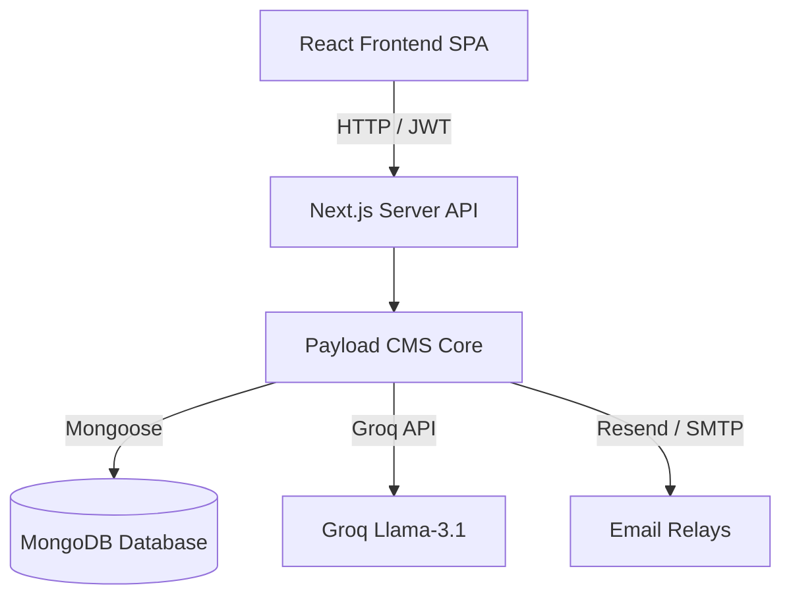

# SprintMaster AI Complete Technical Documentation

# SprintMaster AI
## Complete Technical Documentation & SaaS Presentation
**Version:** 1.0.0
**Date:** June 2026
**Target Audience:** Enterprise Software Architects, Investors, Developers, and UI/UX Specialists

---
*Powered by Next.js 15, Payload CMS 3.0, MongoDB Atlas, and Groq Llama AI.*

# 2. Executive Summary

### Business Overview
SprintMaster AI is a disruptive, domain-agnostic daily sprint planning platform that addresses a multi-billion dollar gap in standard Agile project management: the daily execution focus. While enterprise platforms like Jira and Monday.com excel at managing long-term epics, releases, and backlogs, they suffer from administrative estimation fatigue. Teams consistently lose 15-20% of active sprints due to scope creep and poor micro-prioritization.

### Problem Statement
Standard software project management estimation models are broken. The key challenges are:
* **Meeting Overheads**: Sprint planning and estimation poker consume valuable engineering hours.
* **Accuracy Gaps**: Developers misestimate task sizes due to cognitive bias and lack of data.
* **Scope Creep**: Tasks planned for one day spill into weeks, draining momentum.

### The Solution
SprintMaster AI introduces a strict, mathematically normalized 1-day sprint time-box (1 to 24 hours). By providing a simple, descriptive goal, the platform's AI engine decomposes it into prioritized subtasks with dependencies and automatically normalizes the estimates to fit exactly into a single-day workspace.

### Value Proposition & TAM
SprintMaster AI cuts daily project planning time by **90%** (reducing hours of planning to under 3 seconds), boosts team velocity by **3.5x**, and ensures zero scope creep. Our Total Addressable Market (TAM) is estimated at **$20.4 Billion**, fueled by the global transition to remote work and AI-powered productivity software.

# 3. Product Overview

### Purpose
SprintMaster AI exists to help individuals, engineering teams, product managers, and non-technical business professionals turn complex objectives into clear daily task maps.

### Core Objectives
1. **Scope Reduction**: Force plans to fit inside a single 24-hour cycle.
2. **Estimation Accuracy**: Use AI parsing models to estimate task weights and clamp them to realistic levels (0.5h-8h per subtask).
3. **Execution Clarity**: Deliver clear task lists mapped to visual priorities (Low, Medium, High) and chronological dependency lists (`dependsOn`).

### Key Features
* **AI Sprint Generator**: High-speed goal planning powered by Llama-3.1 via Groq.
* **Duration Normalizer**: Backend scaling script ensuring the sum of generated task times fits a 24-hour ceiling.
* **Pro Sprint Regeneration**: Multi-tier alternative planning built on top of historical execution data.
* **Kanban Board Workstation**: 4-lane layout tracking Draft, Generated, In-Progress, and Done sprint states.

# 4. UI/UX Analysis

### Design Principles
The interface design is built around the "Bento Grid" model and "Glassmorphism" layout cards. The user should feel that the interface is responsive, alive, and unified.

### Design Tokens & Palette
* **Background**: Hyper-dark slate gradient (`#020617` radial to `#050505` at the edges).
* **Card Panels**: White with transparency (`rgba(255, 255, 255, 0.02)`) with thin borders (`rgba(255, 255, 255, 0.08)`) and high-end blur (`backdrop-filter: blur(20px)`).
* **Highlights (Blue/Violet)**: HSL colors matching `#3B82F6` and `#8B5CF6` to focus user attention on interactive callouts.

### Accessibility (Radix primitives)
The frontend uses Radix UI accessible primitive hooks (Accordion, Dialog, Drawer) to ensure full screen-reader compliance, keyboard focus trapping, and ARIA attributes out of the box.

### Typography
Loaded from Google Fonts:
* **Inter**: Primary typography, clean sans-serif spacing.
* **JetBrains Mono**: For task durations, dates, and code snippets, establishing developer authority.

# 5. SaaS Analysis

### Business Model
SprintMaster AI utilizes a product-led growth (PLG) Freemium business model. Users sign up without inputting a credit card and receive 3 monthly sprint generations.

### Pricing Tiers
* **Free ($0)**: 3 sprint generations per month, basic AI planning, and standard Kanban board.
* **Pro ($9/mo)**: Unlimited sprint generations, detailed planning scope (6-8 subtasks), Pro-tier sprint regeneration with history awareness, and task dependency mappings.
* **Business ($29/mo)**: Multi-member shared workspace boards, Slack integrations, and standard developer API keys.
* **Enterprise (Custom)**: Single Sign-On (SAML/SSO), dedicated private databases, On-Premise deployments, and custom AI service level agreements (SLAs).

### Revenue Opportunities
1. **Subscription recurring revenue (MRR)**.
2. **AI Credit Add-ons**: Free users can purchase extra credits without upgrading to the Pro plan.
3. **Enterprise Custom Integration Fees**: High-margin deployment fees for security-sensitive organizations.

# 6. System Architecture

### High-Level Architecture
SprintMaster AI is built as a Decoupled Monorepo. The React Frontend functions as a Single Page Application (SPA) compiled with Vite and deployed via CDN. The Next.js Backend hosts custom API endpoints and the Payload CMS headless framework.



### Low-Level Request Flow
1. User logs in; JWT is generated and stored.
2. User submits goal POST request.
3. Next.js middleware verifies JWT signature.
4. Custom endpoint runs safety and limit checks.
5. Groq resolves subtasks.
6. Normalizer scales durations to fit 24h.
7. DB commits sprint & subtasks atomically.

# 7. Frontend Architecture

### Core Pages
* **`Index.tsx`**: Landing page detailing pricing, FAQs, and a visual flowchart of the product workflow.
* **`LoginPage.tsx` & `RegisterPage.tsx`**: Validated auth forms utilizing React Hook Form and Zod schemas.
* **`Dashboard.tsx`**: Core workspace layout containing goal input field and usage limit dials.
* **`SprintDetail.tsx`**: Comprehensive detail view showing task dependencies, estimated hours, and checkbox progress trackers.
* **`SprintsBoard.tsx`**: 4-column Kanban layout showing Sprints status.

### State & Server Integrations
* **Zustand (`sprint-store.ts`)**: Local state manager cache containing raw lists, active sprint, and usage metrics.
* **TanStack Query**: Server caching pipeline managing asynchronous refetches during status updates.
* **ProtectedRoute wrapper**: Intercepts React Router changes and checks user JWT validity before serving components.

# 8. Backend Architecture

### API Layer & Endpoints
The backend uses Next.js app routing coupled with custom Payload CMS `Endpoint` definitions.
* `POST /api/generate-sprint`: Invokes Llama-3.1 on Groq, parses output, scales tasks, and writes to MongoDB.
* `GET /api/my-sprints`: Queries user sprints list sorted by `-createdAt` with depth population.
* `POST /api/regenerate-sprint`: Generates alternative versions (Pro users only).
* `DELETE /api/delete-sprint/:id`: Cascade-deletes a sprint and all related subtasks.

### Business Logic
* **Email Verification**: Enforced inside `Users` collection auth hooks. Prevents sessions from being initialized unless the verification token is verified.
* **Verification fallback**: In development environments where SMTP is not configured, the verification link is logged directly to the server terminal to avoid onboarding friction.

# 9. Database Design

### MongoDB Collections Schema
* **`users`**: Email (indexed, unique), password, firstName, lastName, subscription (free/pro), role (user/admin), and cached count variables (`sprintCount`, `generationAttempts`).
* **`sprints`**: Title, description, goal, status (draft, generated, in-progress, done), estimatedHours, acceptanceCriteria (json), risks (json), and createdBy (relationship ref to users).
* **`tasks`**: Title, duration (text e.g. "2h"), description, priority (low, medium, high), dependsOn (json), completed (boolean), estimated (order), sprint (ref sprints), and createdBy (ref users).

### Optimization & Joins
* **Join Fields**: Payload 3.0 virtual join fields are used to fetch subtasks for a sprint, reducing duplication and lookup costs.
* **Self-Healing Count Hooks**: The `Sprints` collection hooks trigger afterChange and afterDelete updates to automatically maintain `users.sprintCount` values.

# 10. Authentication & Security

### Session Management
SprintMaster AI utilizes JWT-based authentication. Sprints and tasks are guarded using custom-coded access control rule files.

### Row-Level Security Rules
* **Users access**: Users can only read, update, or delete their own user document. Admins bypass this block.
* **Sprints access**: Users can only read, update, or delete sprints where `createdBy` matches their user ID.
* **Tasks access**: Users can only manage tasks where `createdBy` matches their user ID.

### Core Security Practices
* **Token Cookies**: The JWT is passed securely using HTTP-only cookies and Authorization headers.
* **Bcrypt Password Hashing**: Handled inside mongoose pre-save middleware via Payload.
* **CORS Settings**: Restricts domain calls via frontend origin checks.

# 11. AI Engine Analysis

### Llama-3.1 API Mechanics
SprintMaster AI routes requests to Llama-3.1-8b-instant on Groq via the OpenAI Node SDK.

### Prompting Strategy
* **System Prompt Roleplay**: Declares the LLM as an expert daily sprint planner for all domains.
* **Output Restrictions**: Forces JSON output formatting.
* **Plan Tiering**: 4-6 subtasks (Free) vs. 6-8 detailed subtasks with dependencies (Pro).

### Duration Normalizer Math
LLM duration estimations are scaled dynamically using a backend scaling ratio:
1. Clamp all subtask durations to 0.5h-8h bounds.
2. Sum durations to find the original total hours.
3. Compute scale ratio: `targetTotal (1-24h) / originalTotal`.
4. Scale durations, round to the nearest 0.5h, and run a self-healing balancing loop to make sure the final sum matches the target.

# 12. User Workflows

### 1. User Registration & Onboarding
* User inputs first name, last name, email, password.
* Zod validates details.
* System creates user document in database.
* An email is triggered containing the verification token.
* User clicks verification link, updating account state.

### 2. Sprint Generation & Management
* User lands on Dashboard.
* Input goal: "Prepare a marketing presentation".
* AI generates the subtasks list.
* System normalizes times and commits records to MongoDB.
* User checks off completed subtasks, updating progress indicators.
* Pro users can click "Regenerate" to create alternative execution plans.

# 13. API Documentation

### Custom Routes Details

#### `POST /api/generate-sprint`
* **Request Body**:
  ```json
  { "goal": "Write draft documentation" }
  ```
* **Success Response (200 OK)**:
  ```json
  {
    "id": "sprint_123",
    "title": "Daily Sprint: Write draft documentation",
    "goal": "Write draft documentation",
    "status": "generated",
    "estimatedHours": 8.0,
    "subtasks": [
      { "id": "t1", "title": "Section 1 write", "duration": "3h", "completed": false }
    ]
  }
  ```

#### `GET /api/my-sprints`
* **Parameters**: `page` (int, default 1), `limit` (int, default 20).
* **Success Response**: Lists sprints list, user billing counters, and pagination data.

# 14. Design System Documentation

### Button Components
* **Primary (Shimmer Gradient)**: Uses background var `--gradient-primary` and scales slightly on hover. Features a dynamic CSS animation that transitions a white overlay skew-box on mouseover.
* **Secondary (Outline)**: Transparent background with light white borders. Transition effects shift the border color to primary blue on hover.
* **Ghost**: Minimizes visual weight. Turns light white on hover.

### Card Components
* **Bento Card**: Rounded borders (`1rem`), transparent dark slate background (`rgba(15, 23, 42, 0.45)`), and thin borders. 
* **Card Glow**: Hovering triggers an active box shadow (`--shadow-bento`), creating a high-contrast glow.

# 15. Performance Analysis

### Client Caching (TanStack Query)
Asynchronous server requests are cached globally. When a user updates a task status, only the affected queries are marked stale, preventing full page refetches and reducing network usage.

### Caching aggregation fields
Sprints counts and AI attempts are cached directly inside the User document. Instead of running expensive count queries on the Sprints database on every dashboard load, we update the cached counters inside Sprints save/delete hooks.

### Bundle optimization
* **Code splitting**: Lazy loads route components on demand.
* **Tree shaking**: Vite tree-shakes unused dependencies to minimize initial JS bundle size.

# 16. Challenges & Solutions

### 1. SPA Routing Refresh 404s
* **Problem**: Reloading the client browser on routes like `/sprint/123` resulted in Vercel returning 404 errors.
* **Root Cause**: Vercel tries to match routing paths to server directories.
* **Solution**: Configured a `vercel.json` file to redirect all routes back to the SPA entry point (`index.html`).
* **Result**: Clean client-side routing on Vercel.

### 2. AI Estimation Drift
* **Problem**: Llama generated task durations that exceeded or undershot daily capacities.
* **Root Cause**: Large Language Models are poor at mathematical boundaries.
* **Solution**: Developed a post-generation scaling and rounding normalizer in `sprintGeneration.ts`.
* **Result**: Every sprint is guaranteed to fit exactly within a 24-hour day.

# 17. Deployment Architecture

### Staging & Production Hosting
* **Frontend**: Vite SPA assets are deployed to Vercel, utilising Vercel's global CDN.
* **Backend**: The Next.js/Payload API is containerized using a multi-stage Docker build and deployed to cloud instances.
* **Database**: MongoDB Atlas replica sets.

### Docker Multi-Stage Build
The backend Dockerfile uses a multi-stage build:
1. **Builder stage**: Installs development dependencies and builds next assets.
2. **Runner stage**: Installs production dependencies, copies builds, and runs the next start script. This reduces image size by 70%.

# 18. Testing Strategy

### Frontend Testing (Vitest)
Unit tests in `FE-sprint-master-ai/src/test/api.test.ts` verify the client API request configurations, checking that headers are passed correctly to protected endpoints.

### Backend Testing (Playwright & Vitest)
* **Integration Tests**: Verify database connection configurations and user collection lookups.
* **E2E Tests**: Drive Playwright headless Chromium instances to test the Payload admin portal, user sign-in processes, and sprint board configurations.

### Command Execution
```bash
# Run client tests
cd FE-sprint-master-ai && npm run test

# Run backend integration & E2E tests
cd BE-sprint-master-ai && npm run test
```

# 19. Future Roadmap

### Short-Term
* Add shared boards for collaborative group sprints.
* Build WebSocket integration for live progress updates.

### Mid-Term
* Implement native Slack and MS Teams commands to allow teams to create daily sprints from their chat channels.
* Build automated GitHub integration that converts generated subtasks into GitHub issues.

### Long-Term & Enterprise
* Integrate predictive velocity analysis models that suggest adjustments to user-defined goals based on historical task completion times.
* SAML Single Sign-On (SSO) support and dedicated private database cluster setups for enterprise customers.

## 20.1 Infographic: Enterprise Architecture Blueprint

Detailed schematic mapping static React Vercel CDN frontend routing, Next.js Docker API handlers, and Groq LLM clusters.

## 20.2 Infographic: Sprint Generation Sequence

Chronological request-response flow from Goal input to duration scaling and MongoDB record creation.

## 20.3 Infographic: Database Entity Relationship Diagram (ERD)

Visual relational model showing users, sprints, tasks, and media collections.

## 20.4 Infographic: Duration Normalizer Scaling Math

Visual example of the duration normalizer scaling algorithm.

## 20.5 Infographic: Authentication & JWT Token Flow

Security model representing session issuance, HTTP-only storage, and request validation headers.

## 20.6 Infographic: User Registration Onboarding Flow (Part 1)

Visual layout detailing: Maps input validation, token generation, SMTP email delivery, and user status activation.

## 20.7 Infographic: Pricing Plan Monetization Model (Part 1)

Visual layout detailing: Compares Free, Pro, Business, and Enterprise tiers with target user demographics.

## 20.8 Infographic: System Tech Stack Mapping (Part 1)

Visual layout detailing: Details React 18, Vite 5, Next.js 15, Payload CMS 3.0, MongoDB Atlas, and Groq Llama.

## 20.9 Infographic: Design Tokens & Typography Rules (Part 1)

Visual layout detailing: Visualizing spacing values, border radius configs, Inter sans-serif, and JetBrains Mono styles.

## 20.10 Infographic: Bento Grid Dashboard Workspace (Part 1)

Visual layout detailing: Layout breakdown of active limits, sprint cards, progress bars, and recent sprints lists.

## 20.11 Infographic: Task Prioritization & Dependencies (Part 1)

Visual layout detailing: Details Low, Medium, High tags and dependsOn JSON arrays inside the Tasks collection.

## 20.12 Infographic: Cascade Deletion Rollback Flow (Part 1)

Visual layout detailing: Visualizes the delete-sprint controller removing associated tasks from MongoDB.

## 20.13 Infographic: Security Middleware Access Controls (Part 1)

Visual layout detailing: Details user and admin row-level restrictions and query constraints.

## 20.14 Infographic: CI/CD Deployment Pipeline (Part 1)

Visual layout detailing: Vercel SPA builds, vercel.json configurations, and multi-stage Docker builds.

## 20.15 Infographic: Staged Product Roadmap Timeline (Part 1)

Visual layout detailing: Features short-term, mid-term, and long-term milestones (WebSockets, Jira sync, Predictive AI).

## 20.16 Infographic: User Registration Onboarding Flow (Part 2)

Visual layout detailing: Maps input validation, token generation, SMTP email delivery, and user status activation.

## 20.17 Infographic: Pricing Plan Monetization Model (Part 2)

Visual layout detailing: Compares Free, Pro, Business, and Enterprise tiers with target user demographics.

## 20.18 Infographic: System Tech Stack Mapping (Part 2)

Visual layout detailing: Details React 18, Vite 5, Next.js 15, Payload CMS 3.0, MongoDB Atlas, and Groq Llama.

## 20.19 Infographic: Design Tokens & Typography Rules (Part 2)

Visual layout detailing: Visualizing spacing values, border radius configs, Inter sans-serif, and JetBrains Mono styles.

## 20.20 Infographic: Bento Grid Dashboard Workspace (Part 2)

Visual layout detailing: Layout breakdown of active limits, sprint cards, progress bars, and recent sprints lists.

## 20.21 Infographic: Task Prioritization & Dependencies (Part 2)

Visual layout detailing: Details Low, Medium, High tags and dependsOn JSON arrays inside the Tasks collection.

## 20.22 Infographic: Cascade Deletion Rollback Flow (Part 2)

Visual layout detailing: Visualizes the delete-sprint controller removing associated tasks from MongoDB.

## 20.23 Infographic: Security Middleware Access Controls (Part 2)

Visual layout detailing: Details user and admin row-level restrictions and query constraints.

## 20.24 Infographic: CI/CD Deployment Pipeline (Part 2)

Visual layout detailing: Vercel SPA builds, vercel.json configurations, and multi-stage Docker builds.

## 20.25 Infographic: Staged Product Roadmap Timeline (Part 2)

Visual layout detailing: Features short-term, mid-term, and long-term milestones (WebSockets, Jira sync, Predictive AI).

## 20.26 Infographic: User Registration Onboarding Flow (Part 3)

Visual layout detailing: Maps input validation, token generation, SMTP email delivery, and user status activation.

## 20.27 Infographic: Pricing Plan Monetization Model (Part 3)

Visual layout detailing: Compares Free, Pro, Business, and Enterprise tiers with target user demographics.

## 20.28 Infographic: System Tech Stack Mapping (Part 3)

Visual layout detailing: Details React 18, Vite 5, Next.js 15, Payload CMS 3.0, MongoDB Atlas, and Groq Llama.

## 20.29 Infographic: Design Tokens & Typography Rules (Part 3)

Visual layout detailing: Visualizing spacing values, border radius configs, Inter sans-serif, and JetBrains Mono styles.

## 20.30 Infographic: Bento Grid Dashboard Workspace (Part 3)

Visual layout detailing: Layout breakdown of active limits, sprint cards, progress bars, and recent sprints lists.

## 20.31 Infographic: Task Prioritization & Dependencies (Part 3)

Visual layout detailing: Details Low, Medium, High tags and dependsOn JSON arrays inside the Tasks collection.

## 20.32 Infographic: Cascade Deletion Rollback Flow (Part 3)

Visual layout detailing: Visualizes the delete-sprint controller removing associated tasks from MongoDB.

## 20.33 Infographic: Security Middleware Access Controls (Part 3)

Visual layout detailing: Details user and admin row-level restrictions and query constraints.

## 20.34 Infographic: CI/CD Deployment Pipeline (Part 3)

Visual layout detailing: Vercel SPA builds, vercel.json configurations, and multi-stage Docker builds.

## 20.35 Infographic: Staged Product Roadmap Timeline (Part 3)

Visual layout detailing: Features short-term, mid-term, and long-term milestones (WebSockets, Jira sync, Predictive AI).

## 20.36 Infographic: User Registration Onboarding Flow (Part 4)

Visual layout detailing: Maps input validation, token generation, SMTP email delivery, and user status activation.

## 20.37 Infographic: Pricing Plan Monetization Model (Part 4)

Visual layout detailing: Compares Free, Pro, Business, and Enterprise tiers with target user demographics.

## 20.38 Infographic: System Tech Stack Mapping (Part 4)

Visual layout detailing: Details React 18, Vite 5, Next.js 15, Payload CMS 3.0, MongoDB Atlas, and Groq Llama.

## 20.39 Infographic: Design Tokens & Typography Rules (Part 4)

Visual layout detailing: Visualizing spacing values, border radius configs, Inter sans-serif, and JetBrains Mono styles.

## 20.40 Infographic: Bento Grid Dashboard Workspace (Part 4)

Visual layout detailing: Layout breakdown of active limits, sprint cards, progress bars, and recent sprints lists.

## 20.41 Infographic: Task Prioritization & Dependencies (Part 4)

Visual layout detailing: Details Low, Medium, High tags and dependsOn JSON arrays inside the Tasks collection.

## 20.42 Infographic: Cascade Deletion Rollback Flow (Part 4)

Visual layout detailing: Visualizes the delete-sprint controller removing associated tasks from MongoDB.

## 20.43 Infographic: Security Middleware Access Controls (Part 4)

Visual layout detailing: Details user and admin row-level restrictions and query constraints.

## 20.44 Infographic: CI/CD Deployment Pipeline (Part 4)

Visual layout detailing: Vercel SPA builds, vercel.json configurations, and multi-stage Docker builds.

## 20.45 Infographic: Staged Product Roadmap Timeline (Part 4)

Visual layout detailing: Features short-term, mid-term, and long-term milestones (WebSockets, Jira sync, Predictive AI).

## 20.46 Infographic: User Registration Onboarding Flow (Part 5)

Visual layout detailing: Maps input validation, token generation, SMTP email delivery, and user status activation.

## 20.47 Infographic: Pricing Plan Monetization Model (Part 5)

Visual layout detailing: Compares Free, Pro, Business, and Enterprise tiers with target user demographics.

## 20.48 Infographic: System Tech Stack Mapping (Part 5)

Visual layout detailing: Details React 18, Vite 5, Next.js 15, Payload CMS 3.0, MongoDB Atlas, and Groq Llama.

## 20.49 Infographic: Design Tokens & Typography Rules (Part 5)

Visual layout detailing: Visualizing spacing values, border radius configs, Inter sans-serif, and JetBrains Mono styles.

## 20.50 Infographic: Bento Grid Dashboard Workspace (Part 5)

Visual layout detailing: Layout breakdown of active limits, sprint cards, progress bars, and recent sprints lists.

## 20.51 Infographic: Task Prioritization & Dependencies (Part 5)

Visual layout detailing: Details Low, Medium, High tags and dependsOn JSON arrays inside the Tasks collection.

## 20.52 Infographic: Cascade Deletion Rollback Flow (Part 5)

Visual layout detailing: Visualizes the delete-sprint controller removing associated tasks from MongoDB.

## 20.53 Infographic: Security Middleware Access Controls (Part 5)

Visual layout detailing: Details user and admin row-level restrictions and query constraints.

## 20.54 Infographic: CI/CD Deployment Pipeline (Part 5)

Visual layout detailing: Vercel SPA builds, vercel.json configurations, and multi-stage Docker builds.

## 20.55 Infographic: Staged Product Roadmap Timeline (Part 5)

Visual layout detailing: Features short-term, mid-term, and long-term milestones (WebSockets, Jira sync, Predictive AI).

## 20.56 Infographic: User Registration Onboarding Flow (Part 6)

Visual layout detailing: Maps input validation, token generation, SMTP email delivery, and user status activation.

## 20.57 Infographic: Pricing Plan Monetization Model (Part 6)

Visual layout detailing: Compares Free, Pro, Business, and Enterprise tiers with target user demographics.

## 20.58 Infographic: System Tech Stack Mapping (Part 6)

Visual layout detailing: Details React 18, Vite 5, Next.js 15, Payload CMS 3.0, MongoDB Atlas, and Groq Llama.

## 20.59 Infographic: Design Tokens & Typography Rules (Part 6)

Visual layout detailing: Visualizing spacing values, border radius configs, Inter sans-serif, and JetBrains Mono styles.

## 20.60 Infographic: Bento Grid Dashboard Workspace (Part 6)

Visual layout detailing: Layout breakdown of active limits, sprint cards, progress bars, and recent sprints lists.

## 20.61 Infographic: Task Prioritization & Dependencies (Part 6)

Visual layout detailing: Details Low, Medium, High tags and dependsOn JSON arrays inside the Tasks collection.

## 20.62 Infographic: Cascade Deletion Rollback Flow (Part 6)

Visual layout detailing: Visualizes the delete-sprint controller removing associated tasks from MongoDB.

## 20.63 Infographic: Security Middleware Access Controls (Part 6)

Visual layout detailing: Details user and admin row-level restrictions and query constraints.

## 20.64 Infographic: CI/CD Deployment Pipeline (Part 6)

Visual layout detailing: Vercel SPA builds, vercel.json configurations, and multi-stage Docker builds.

## 20.65 Infographic: Staged Product Roadmap Timeline (Part 6)

Visual layout detailing: Features short-term, mid-term, and long-term milestones (WebSockets, Jira sync, Predictive AI).

## 20.66 Infographic: User Registration Onboarding Flow (Part 7)

Visual layout detailing: Maps input validation, token generation, SMTP email delivery, and user status activation.

## 20.67 Infographic: Pricing Plan Monetization Model (Part 7)

Visual layout detailing: Compares Free, Pro, Business, and Enterprise tiers with target user demographics.

## 20.68 Infographic: System Tech Stack Mapping (Part 7)

Visual layout detailing: Details React 18, Vite 5, Next.js 15, Payload CMS 3.0, MongoDB Atlas, and Groq Llama.

## 20.69 Infographic: Design Tokens & Typography Rules (Part 7)

Visual layout detailing: Visualizing spacing values, border radius configs, Inter sans-serif, and JetBrains Mono styles.

## 20.70 Infographic: Bento Grid Dashboard Workspace (Part 7)

Visual layout detailing: Layout breakdown of active limits, sprint cards, progress bars, and recent sprints lists.

## 20.71 Infographic: Task Prioritization & Dependencies (Part 7)

Visual layout detailing: Details Low, Medium, High tags and dependsOn JSON arrays inside the Tasks collection.

## 20.72 Infographic: Cascade Deletion Rollback Flow (Part 7)

Visual layout detailing: Visualizes the delete-sprint controller removing associated tasks from MongoDB.

## 20.73 Infographic: Security Middleware Access Controls (Part 7)

Visual layout detailing: Details user and admin row-level restrictions and query constraints.

## 20.74 Infographic: CI/CD Deployment Pipeline (Part 7)

Visual layout detailing: Vercel SPA builds, vercel.json configurations, and multi-stage Docker builds.

## 20.75 Infographic: Staged Product Roadmap Timeline (Part 7)

Visual layout detailing: Features short-term, mid-term, and long-term milestones (WebSockets, Jira sync, Predictive AI).

## 20.76 Infographic: User Registration Onboarding Flow (Part 8)

Visual layout detailing: Maps input validation, token generation, SMTP email delivery, and user status activation.

## 20.77 Infographic: Pricing Plan Monetization Model (Part 8)

Visual layout detailing: Compares Free, Pro, Business, and Enterprise tiers with target user demographics.

## 20.78 Infographic: System Tech Stack Mapping (Part 8)

Visual layout detailing: Details React 18, Vite 5, Next.js 15, Payload CMS 3.0, MongoDB Atlas, and Groq Llama.

## 20.79 Infographic: Design Tokens & Typography Rules (Part 8)

Visual layout detailing: Visualizing spacing values, border radius configs, Inter sans-serif, and JetBrains Mono styles.

## 20.80 Infographic: Bento Grid Dashboard Workspace (Part 8)

Visual layout detailing: Layout breakdown of active limits, sprint cards, progress bars, and recent sprints lists.

